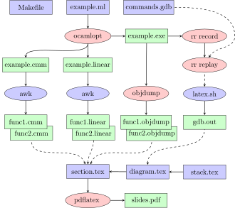

# OCaml behind the scenes: exceptions

Sources of the slides and examples of the tech talk given at Tarides, Paris, on 2022/11/18.

Rendered slides are available in the [releases](https://github.com/fabbing/obts_exn/releases/).

This talk is about understanding how OCaml exceptions are implemented in native code.
What happens at the lowest level when an exception is raised and when it’s caught? OCaml exceptions are said to be particularly fast; how is it achieved?

# Outline

* Assembly
  * x86-64 asssembly
* Catching exceptions
  * Exceptions are values
  * Exception handlers
  * Installing a trap
  * Removing a trap
  * Raise
* Nested handlers
  * Multiple handlers, multiple traps
  * Raise and reraise
* Bonus: Default handler
  * Runtime's default exception handler

# Building

## Commands
```sh
make ocaml
make sources
make presentation
```

## Dependencies
* pdflatex (packages: Beamer, Minted, TikZ, xstring, xint)
* python pygments
* rr, gdb
* objdump
* awk, sed
* make

## Build graph

